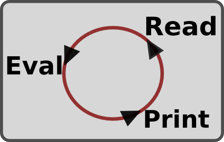

# Node.js와 상호작용하기
## REPL(Read, Evaluate, Print, Loop)

## 모듈의 import와 export
(코드로 학습하기)

## Node 내장 객체
### window/document
브라우저 객체이므로 Node에서는 사용 불가 
### global
브라우저의 window의 객체 역할을 global이 대체한다고 생각하면 됨  
### console
global 객체 아래에 global.console로 존재. 브라우저에서의 console과 유사  
### timer
### exports
### process
현재 실행되고 있는 Node 프로세스에 대한 정보  
process.nextTick : 이벤트 루프가 다른 콜백 함수보다 nextTick의 콜백을 우선 처리  
[nextTick.js](nextTick.js) 해석  
    setImmediate가 호출 -> 백그라운드 처리 -> 마이크로테스크 큐에 적재  
    nextTick호출 -> 백그라운드 처리 -> 테스크 큐 우선 적재  
    setTimeout 호출 -> 백그라운드 처리 -> 테스크 큐에 적용  
    Promise.resolve 호출 -> 백그라운드 처리 -> 마이크로테스크 큐에 적재  
    
    이벤트 루프가 돌면서 마이크로테스크 큐 -> 테스크 큐 순으로 처리